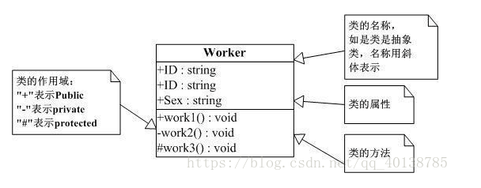
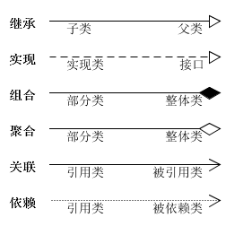
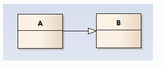
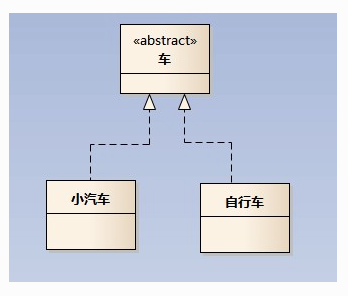
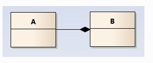
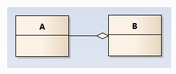
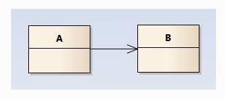
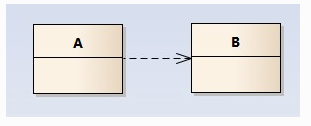

1. UML类图

    >UML类图是一种结构图，用于描述一个系统的静态结构。类图以**反映类结构和类之间关系**为目的，用以描述软件系统的结构，是一种静态建模方法。

2. 在类图中一般包含了以下几种关系：类（Class），接口（Interface）以及类之间的关系。

    1. 类：在面向对象编程中，**类是对现实世界中一组具有相同特征的物体的一种抽象。**

    

    2. 接口：接口是一种特殊的类，具有类的结构但不可被实例化，只可以被实现（继承）。在UML中，接口则需在上方加上**`<<interface>>`。**

3. 类图中的关系

    在类图中，主要关系有六种：**继承（泛化），实现，组合，聚合，关联和依赖**。

    

    1. 继承：也称泛化关系（Generalization），用于描述父类与子类之间的关系。父类又称作基类，子类又称作派生类。继承关系中，子类继承父类的所有功能，父类所具有的属性、方法，子类应该都有。子类中除了与父类一致的信息以外，还包括额外的信息。泛化关系用一条带空心箭头的直接表示。

        

    2. 实现：用一条带空心箭头的虚线表示；eg：”车”为一个抽象概念，在现实中并无法直接用来定义对象；只有指明具体的子类(汽车还是自行车)，才可以用来定义对象。

        

    3. 组合：组合关系用一条带实心菱形箭头直线表示，如下图表示A组成B，或者B由A组成；**组合关系表示整体由部分构成的语义；但组合关系是一种强依赖的特殊聚合关系，如果整体已不存在，则部分也不存在。**

        

    4. 聚合：聚合关系用一条带空心菱形箭头的直线表示，如下图表示A聚合到B上，或者说B由A组成；**整体和部分的关系，整体与部分可以分开。**

        

    5. 关联：关联关系是用一条直线表示的；关联关系是类与类之间最常用的一种关系，表示一类对象与另一类对象之间有联系。**关联关系默认不强调方向，表示对象间相互知道**；如果特别强调方向，如下图，表示A知道B，但 B不知道A；**注：在最终代码中，关联对象通常是以成员变量的形式实现的。**

        

    6. 依赖：依赖关系是用一套带箭头的虚线表示的；如下图表示A依赖于B；他描述一个对象在运行期间会用到另一个对象的关系；依赖也有方向，双向依赖是一种非常糟糕的结构，我们总是应该保持单向依赖，杜绝双向依赖的产生；注：**依赖关系体现为类构造方法及类方法的传入参数，箭头的指向为调用关系；依赖关系除了临时知道对方外，还是“使用”对方的方法和属性。**

        

4. 关系的强弱

    这六种类关系中，组合、聚合和关联的代码结构一样，可以从关系的强弱来理解，**各类关系从强到弱依次是：继承（类与继承关系）→实现（类与接口关系）→组合（整体与部分关系，不可分离）→聚合（整体与部分关系，可分离存在）→关联（拥有的关系）→依赖（使用的关系）。**

